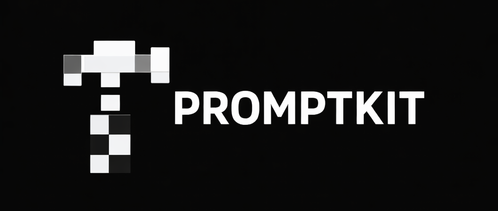

<p align="center">
  
</p>

<p align="center">
  <a href="LICENSE.md"></a>
</p>

A CLI that scaffolds spec-driven development workflows for AI coding agents. Supports Go, Rust, and Zig ecosystems with FRD-based or journey-based workflows.

promptkit generates AGENTS.md, instruction skills, Makefile, linter config, and helper scripts from templates — customized for your project, ecosystem, and the AI agents you use.

## Prerequisites

- Go 1.22+ (to build from source)

## Install

```bash
go install github.com/dmitriy/promptkit/cmd/promptkit@latest
```

Or build from source:

```bash
git clone https://github.com/dmitriy/promptkit.git
cd promptkit
make install
```

## Quick Start

```bash
# Interactive — prompts for ecosystem, workflow, module path, agents, etc.
promptkit init my-project

# Non-interactive Go project
promptkit init my-project \
  --non-interactive \
  --name "myapp" \
  --module "github.com/user/myapp" \
  --ai claude,cursor

# Rust project with journey workflow
promptkit init my-project \
  --non-interactive \
  --ecosystem rust \
  --workflow journey \
  --name "myapp" \
  --module "github.com/user/myapp" \
  --ai claude
```

This generates:

```
my-project/
  .promptkit.yaml          # Config — edit this, then run promptkit update
  AGENTS.md                # Agent personality and development workflow
  .golangci.yml            # Linter config (ecosystem-specific)
  Makefile                 # Build, test, lint targets
  .agents/skills/          # Agent Skills (cross-agent standard)
    implement/SKILL.md     # /implement — TDD implementation workflow
    roadmap/SKILL.md       # /roadmap — Spec decomposition
    frd/SKILL.md           # /frd or /journey — Feature requirements
    perf/SKILL.md          # /perf — Performance diagnosis
```

From there, one config file drives everything:

```bash
vim .promptkit.yaml    # Change thresholds, add agents, switch workflow
promptkit update       # Review diff, approve — done
```

## Ecosystems

| Ecosystem | Linter | Build System | Analysis Command |
|-----------|--------|--------------|------------------|
| `golang` | golangci-lint v2 | Makefile | `go vet ./...` |
| `rust` | Clippy + rustfmt | Makefile (cargo) | `cargo clippy -- -D warnings` |
| `zig` | — | Makefile (zig build) | `zig build test` |

Set with `--ecosystem` at init time or `ecosystem:` in config.

## Workflows

Two development methodologies are available:

- **`frd`** (default) — spec -> `/roadmap` -> `/frd` -> `/implement` -> `/perf`. Each roadmap item gets a Feature Requirements Document (MoSCoW, stressor scenarios, test matrix).
- **`journey`** — spec -> `/roadmap` -> `/journey` -> `/implement` -> `/perf`. Each roadmap item gets a journey document (CJM with phases, friction analysis, UX assessment).

Set with `--workflow` at init time or `workflow:` in config. See [Workflows](docs/workflows.md) for details.

## Multi-Agent Support

Skills in `.agents/skills/` work natively with Claude Code, Codex CLI, GitHub Copilot, and Cursor. For other agents, promptkit generates adapter files:

| Agent | Generated Files |
|-------|-----------------|
| **Claude Code** | `.agents/skills/` + `.claude/commands/` |
| **Codex CLI** | `.agents/skills/` (reads `AGENTS.md` natively) |
| **GitHub Copilot** | `.agents/skills/` + `.github/copilot-instructions.md` |
| **Cursor** | `.agents/skills/` + `.cursor/rules/agents.mdc` |
| **Gemini CLI** | `GEMINI.md` + `.gemini/commands/` |
| **Windsurf** | `.windsurfrules` + `.windsurf/workflows/` |

All agents receive identical instructions — same workflow, same quality gates, same TDD process.

```bash
promptkit init --ai claude,gemini,cursor .
```

## Commands

| Command | Description |
|---------|-------------|
| `promptkit init [dir]` | Scaffold a new project (interactive or `--non-interactive`) |
| `promptkit update` | Re-render templates after config changes, with diff review |
| `promptkit diff` | Preview what `update` would change |
| `promptkit status` | Check if generated files are up to date (CI-friendly, exits 1 on drift) |
| `promptkit doctor` | Validate generated files for correctness |
| `promptkit clean` | Remove stale generated files |
| `promptkit template list\|render\|extract\|add\|vars` | Manage template overrides |
| `promptkit config explain [key]` | Show which files a config field affects |

See [Commands Reference](docs/commands.md) for full flag documentation.

## Configuration

All values live in `.promptkit.yaml`. Key fields:

```yaml
version: 2
project_name: myapp
module_path: github.com/user/myapp
ecosystem: golang          # golang, rust, zig
workflow: frd              # frd, journey
agents: [claude, cursor]
quality:
  coverage_min: 85
  coverage_critical: 90
```

See [Configuration Reference](docs/configuration.md) for all fields, validation rules, and migration.

## Documentation

| Document | Contents |
|----------|----------|
| [Commands Reference](docs/commands.md) | All commands, flags, and examples |
| [Configuration Reference](docs/configuration.md) | Config fields, validation, migration |
| [Workflows](docs/workflows.md) | FRD and journey workflow details |
| [Templates](docs/templates.md) | Template overrides, variables, skills reference |
| [Architecture](docs/architecture.md) | Project structure, safety model, internals |

## License

Licensed under the [Apache License 2.0](LICENSE.md).
